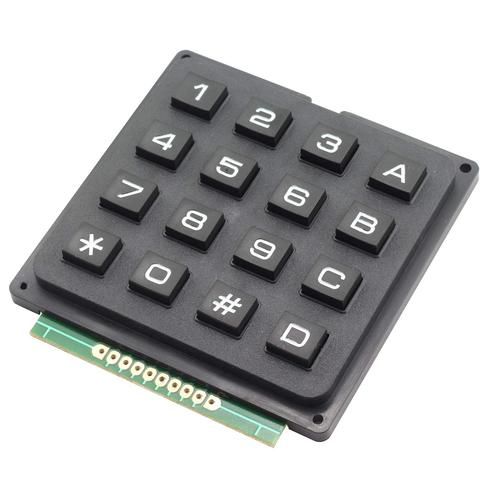

# 4x4-keypad-driver-atmega328p
A low-level driver for a 4x4 keypad on the AVR ATMega28P microcontroller



## Construction
### Hardware Setup
- The 8 keypad pins connected directly to the Arduino pin headers (The choice for the pins is explained in the next section)
- Optional external pull-up resistors for the row pins (R1, R2, R3, R4)
- Optional debounce capacitors (I didn't have much issue with bouncing, I found software debouncing sufficient for this application)
    - Hardware debouncing capacitors can further reduce the code footprint if desired

### Software Setup
- Pins on the Arduino connected to the rows on Pin Change Interrupt (PCINT) pins
    - Initialized as inputs with the internal pull-up resistors enabled
    - I used pin change interrupts (PCINT) because of the limited number of interrupt (INT) pins on the ATMega328P, which I were in use with some other hardware
- Pins on the Arduino connected to the columns on any other pins
    - Initialized as outputs with a default low state

If you look at my code you'll notice that the pins I've chosen are on two different ports: Port C and Port D, each selection of either row or column pins consists of a bank of 4 consecutive pins. This eases the control of the pins and the execution of binary operations on either all row pins or all column pins.
- PD0 - PD3 -> Column pins
- PC0 - PC3 -> Row pins

#### Keypad setup function

Below is a breakdown of the ```keypad_setup()``` function

- Enable the Pin change interrupt 1. This enables pin change interrupts on PCINT8...PCINT14
```c
// enable pin change interrupts
PCICR |= (1 << PCIE1);
```

- Initialize the row pins as inputs and enable internal pull-ups
```c
// set pins to inputs
  DDRC &= ~(1 << DDC0) & ~(1 << DDC1) & ~(1 << DDC2) & ~(1 << DDC3);
  // enable internal pull-ups
  PORTC |= (1 << PORTC0) | (1 << PORTC1) | (1 << PORTC2) | (1 << PORTC3);
```

- Mask the pin change interrupt mask bits on the pin change interrupts corresponding to the row pins
```c
// enable interrupts on pins
  PCMSK1 |= (1 << PCINT8) | (1 << PCINT9) | (1 << PCINT10) | (1 << PCINT11);
```

- Initialize the column pins as outputs and set their default level to low
```c
// pull all columns low
DDRD |= (1 << DDD4) | (1 << DDD5) | (1 << DDD6) | (1 << DDD7);
PORTD &= ~(1 << PORTD4) & ~(1 << PORTD5) & ~(1 << PORTD6) & ~(1 << PORTD7);
```

#### ISR function
The ISR is set to receive interrupts on the Pin Change Interrupt 1, by specifying the ```PCINT1_vect``` interrupt vector

Below is a breakdown of the ```ISR(PCINT1_vect)``` function:

- Debounce handling. Any interrupts received within less than the debounce time after the first interrupt has been triggered are ignored.
```c
// include debounce time 
if ((get_timing_millis() - lastKeyPressMillis) >= 50)
{
lastKeyPressMillis = get_timing_millis();
}
```

- Next. we save the previous key state of the row keys
```c
previousKeyState = keyState;
```

- We then read in the current key state for the row keys. The operation reads in the entire port's Pin values, ```PC0 - PC7``` and then discards the upper bits ```PC4 - PC7``` using a left shift, and stores our bits of interest in the upper 4 bits, leaving the lower bits as 0. (The resulting position of our bits of interest doesn't really matter. We move them to the upper 4 bits for convenience - it only requires a single operation)
```c
// shift readings of PC0 - PC4 into the upper 4 bits of the 8-bit value
keyState = (PINC << 4);
```

- We sanitize our detected keystate events, we're only interested in cases where our current and previous key states are different
```c
// If the keystate has changed (the interrupt is called both on the rising and falling edges)
if (previousKeyState != keyState)
{
}
```

- Take different actions depending on whether the change we've detected is on a rising or a falling edge
    - The first condition is only fulfilled when at least one row pin has changed state to a low-level(0).
    - We XOR the current keystate with 0xF0 to check for this occurrence. If all of the keys are still in their default level (high-level) the condition tests false
    - The second condition is only fulfillled when all the row pins have resumed their normal state (high-level). This indicates a rising edge, or a key release
```c
if (keyState ^ 0xF0) // falling edge (check for zero in keyState)
{
    currentKeyEdge = FALLING_EDGE;
}
else if (keyState == 0xF0)
{
    currentKeyEdge = RISING_EDGE;
}
```

- We check which row has changed state.
 - Perhaps this could be more efficient, we could use a binary operation instead of using if statements to check every single row **DEFINITELY AN IDEA FOR THE FUTURE**
 ```c
 // Serach for the row for which the change occurred
if (bit_is_clear(PINC, PC0)) currentRow = ROW_1;
if (bit_is_clear(PINC, PC1)) currentRow = ROW_2;
if (bit_is_clear(PINC, PC2)) currentRow = ROW_3;
if (bit_is_clear(PINC, PC3)) currentRow = ROW_4;
 ```

 - Next, we set all our columns high, and then pull them low, one at a time, and check if we get a corresponding change on the previously identified row.
    - At the end of this sequence we change the columns back to their default state (low-level)
    - We include a delay of about 5us (80 clock ticks) `````` because the change in the logic output level from the port is not immediate. Imperically, 5us is sufficient for this change to take effect
    - If the currentRow level changes to low, after pulling a single column low, the column that causes the change is our target column

```c
// pull cols high *verified*
PORTD |= (1 << PORTD4) | (1 << PORTD5) | (1 << PORTD6) | (1 << PORTD7);

// Wait for the columns to change state
while ((PIND >> 4) != 0x0F);

// loop through columns 
for (int col = 0; col < NUM_COLS; col++)
{
    timerCnt = 0;
    TCNT1 = 0;
    // set a single column low at a time *verified*
    PORTD &= ~(1 << (col+4));

    // delay for external change to take effect
    // For some reason it takes different times for the change to take effect
    // Imperically: 24clks for row 1, 34 clks for row 2, 44 clks for row 3, 54 clks for row 4
    // And some sporadic bursts of up to 65clks (as per observations
    while (TCNT1 < 80); // delay for 5us
    
    /**
     * If the row has changed state, then we've found the culprit column!
     * Else return the column to its original state and proceed to test the next column
     */
    if (bit_is_clear(PINC, currentRow))
    {
        currentCol = col;
        break;
    }
    else
    {
        PORTD |= (1 << (col+4));
    }
}

// Reset the states of all the columns
PORTD &= ~(1 << PORTD4) & ~(1 << PORTD5) & ~(1 << PORTD6) & ~(1 << PORTD7);
```

- Finally we execute our ```keypad_event_listener``` function whihc passes the event to higher level abstractions

```c
// Execute the keypad-event detected routine
keypad_event_listener();
```

#### Keypad event listener function

If a callback has been set, this function calls the callback with the corresponding key, and the event press/release corresponding to falling/rising edge.
```c
/**
 * @brief	 Function called when a keypad-event is detected
 *        This function in-turn calls the keypad callback with the key-character,
 *        and the signal state of the detected signal change (rising or falling)
 * 
 * @param none
 * @return none
 */
void keypad_event_listener(void)
{
  // If a callback is not defined, return
  if(!keypad_event_callback) return;

  keypad_event_callback(key[currentRow][currentCol], currentKeyEdge);

  if (currentKeyEdge == RISING_EDGE) currentKeyEdge = EDGE_NONE;
}
```

### Pros:
- The program makes for very fast detection of keypad events (key presses and releases).

### Cons:
- The program is not very portable, perhaps this is also something to address in the future?
    - If this isn't particularly a necessity for you, feel free to adapt the code as-is to your particular use-case

### Improvements:
- Perhaps the program could be adapted to handle multiple key presses simultaneously
